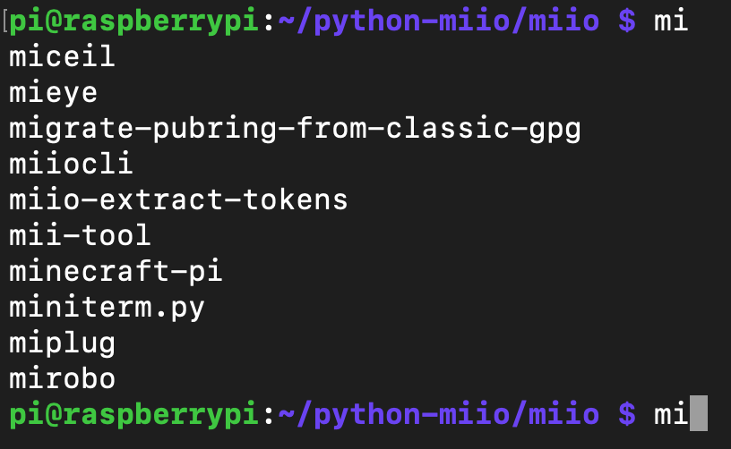
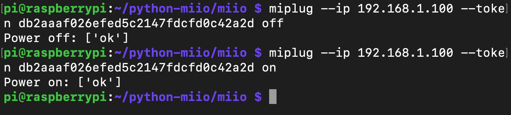

# Directly control my Mi-Plug\(Wi-Fi Edition\) without Mi Home App

Lately  I bought a Smart Adapter from XiaoMi, what depressed me is that I can only control my Mi-Plug through Mi Home App. I just want to control that adapter directly through some scripts or whaterver else , so I search the Internet and finally , after SO MANY disappointments , I got the token and it's time to record it !

### 1.Install a specifi version of the Mi Home App \(5.4.63\)

Maybe some other versions can also get toekn through APP directly, try it as your wish


### 2.Find your token in your App "Network Information"


This would change if you change the router your adapter connects

### 3.Install "miio" in your Linux \(maybe ubuntu or else, I install it in my raspberry pi \)

```bash
gitclonehttps://github.com/rytilahti/python-miio

cd python-miio/

python3.5 setup.py install
```

After that , check if everthing is installed 



what we need is that "**miplug**"

### 4.Use ''miplug" to control your MI-Plug

From the Usage we can know that , we need "IP" and "token" to control the plug, all the two arguement can check in the App. Now , use the command to turn on&off the adapter



If the command return "OK", that means you have successfully dominated this adapter ! Without the Mi Home App , link it to your Home Assist or whatever else ~


> [https://paper.seebug.org/616/](https://paper.seebug.org/616/)
>
> [https://bbs.hassbian.com/archiver/?tid-6717.html&page=1](https://bbs.hassbian.com/archiver/?tid-6717.html&page=1)

