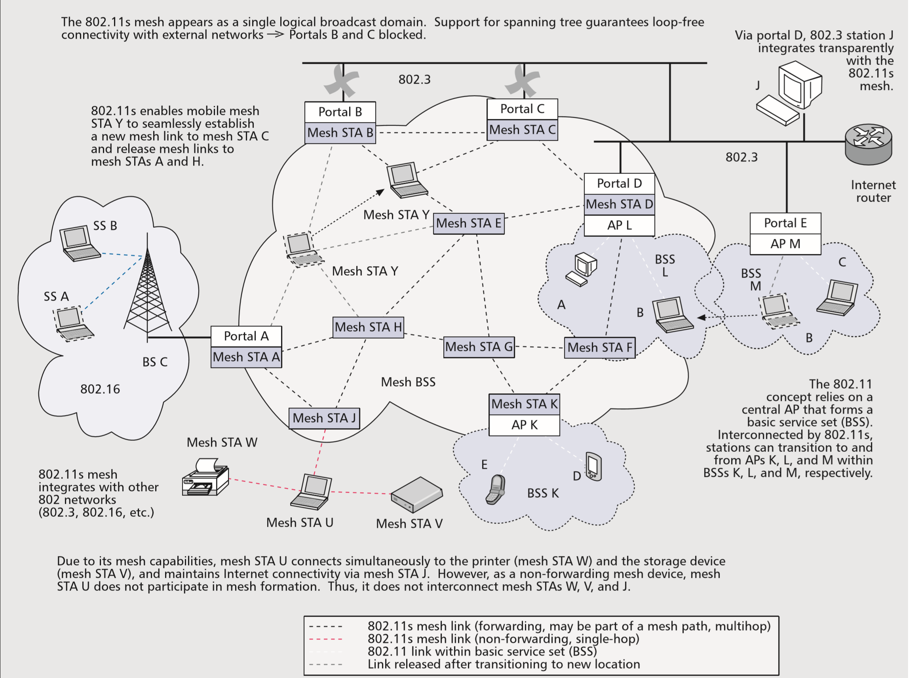
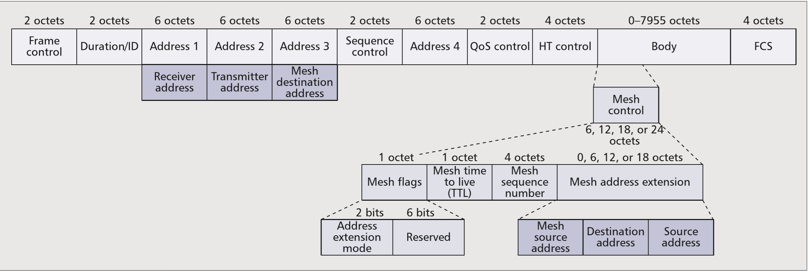
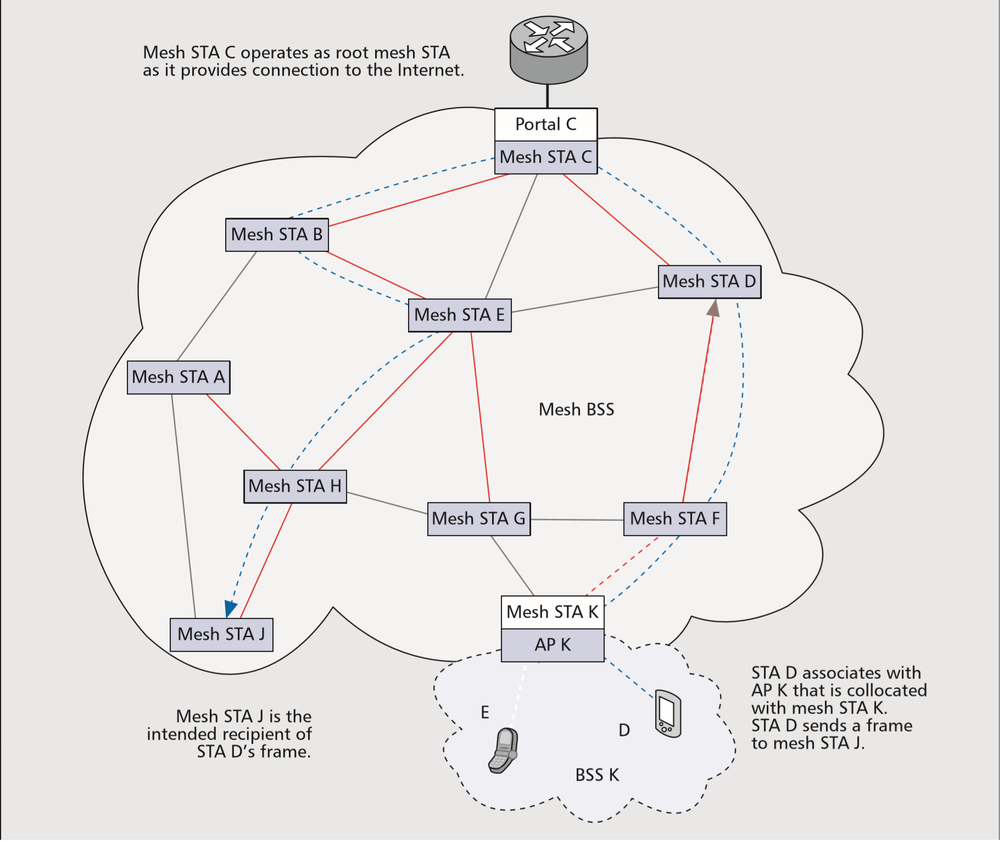
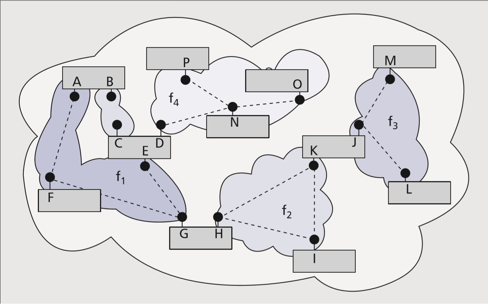

# IEEE 802.11s 无线Mesh标准

## 1. 摘要

无线局域网通信标准--IEEE 802.11是廉价通信服务的一种较为普遍的解决方案. 它能成功的关键就在于不受限制的2.4G 与 5G通信频段. 由于法律规定限制了发射功率，这使得这两个频段下的信号覆盖范围也受到了限制. 然而, 对于"更大"的无线覆盖范围却在不停增长, 从公司/校园,到各式各样的城市建设. 为了克服单跳网络的限制,数据包需要遍历多个无线跳, 这就需要用到无线MESH网络. 自2004以来, GROUP S 一直在研究802.11的修正案，以确切解决上述对于多跳通信的网络需求. 除了介绍无线帧转发以及MAC层的路由功能, 802.11s修正案还带来了新的互通性与安全性. 这篇文章将主要介绍802.11s的最新发展, 并解释整个MESH网络的概念是如何与802的协议族做适配的

## 2.介绍

WLAN的爆炸式发展以及无处不在的对于无线连接的需求,使得WLAN的覆盖范围的发展变得迫在眉睫. 然而, 相关法规限制了WLAN设备的发射功率

历史上曾有过类似的经历, “桥接“的出现使得以太网标准\(802.3\)从单跳系统进化为了多跳系统. 有了桥接, 两个终端进行通信不再需要在同一个LAN内. 与有线的前辈比起来, 无线还处于萌芽阶段. 当前802.11 的通信仍然依赖有线网络来实现桥接功能. 出于种种原因, 这种对于有线的依赖必须被消除. 第一, 这种组网方式昂贵且不可靠, 因为WLAN的范围不能超越回程\(backhaul\)的部署范围之外. 第二, 中心化的结构工作起来效率底下, 比如以下的应用场景: 无线游戏,需要建立P2P的连接. 第三, 固定的拓扑结构限制了终端设备去选择更好的链路来通信. WLAN如果能满足这些迫切的需求, 将从中受益匪浅.

无线网状网络\(WMN\)能够提供解决方案. 然而, 现有的WMNs 依赖IP层实现多跳通信并且不提供固有的解决方案. 由于无线链路相较于有线链路更加的不可靠, 因此运行在无线环境中的多跳路由协议必须考虑无线链路所处的环境. 由于802.11 并没有指定IP层从MAC层获取链路度量所需要的接口, 因此Internet 工程任务组\(IETF\)的移动自组织网络\(MANET\)开发了自组织路由协议. 该小组被迫依靠间接测量来观察无线环境. 但是这种测量法的准确性不太足, 而MAC层对其无线电领域则具有足够的了解, 这使得测量值准确且实时. 此外, 为了透明地支持一些重要的协议, 例如 ARP,DHCP,生成树等,WMN要看起来像传统的LAN一样,有单一的广播域.在封装第二层流量时,基于IP的WMN会去模拟 LAN的行为,并且没有提供旨在将WLAN可持续扩展到新应用的长期解决方案.由于基于MAC的多跳解决方案固有地支持2层流量，因此它们对任何更高层协议都是透明的

为了实现基于MAC的WMN所宣城能够带来的优势, IEEE 802.11 Task Group S 正在开发一种集成式的Mesh网络解决方案. 802.11标准中涉及网状支持802.11s的特定修正案描述了WMN概念，该概念在MAC层引入了路由功能, 路径选择用于引用基于MAC地址的路由，并将其与常规IP路由区分开.

为了了解一下广义的WLAN的概念, 我们将要先简要地介绍一下 802.11的标准. 然后, 介绍了802.11s 的基本轮廓, 拓展地解释了一下,上面提到的 互通，MAC，安全性和选路. 然后会讨论WiFi联盟中mesh 解决方案的认证情况. 最后一段则专门用来介绍 例如 一童一电脑 和 open802.11s项目, 用以揭示802.11s草案的性能, 并且可以让我们看看被802.11s认证过的产品应该是怎么样的.

## 3. 802.11网络设计

一个 基站, 或者一个STA, 是符合802.11设计的MAC层与物理层的, 也是构成802.11网络的基本实体. 两个基站就可以构成一个最基本的802.11的网络, 这被称为一个基础服务集\(BSS, basic service set\). 如果这个基站向另一个基站提供了集成的服务, 那么这个站就被称为接入点\(AP, access point\).如果AP存在于BSS中, 则称为基础结构BSS. 要加入基础设施BSS, 站点需要与AP关联.

图1提供了一个示例, 其中AP M是基础结构的一部分, AP M为站点B和C提供访问分发系统（DS）的权限. DS提供了与站点自己的BSS之外的设备进行通信所需的服务. 此外, DS允许AP组合多个BSS以形成扩展服务集\(ESS\) 在ESS内，站点可以从一个BSS漫游到另一个. 如今, 以太网\(802.3\)通常提供DS所依赖的分发系统介质. 因此,实际中, AP与所谓的门户一同, 为非802.11的网络提供集成的WLAN服务.

IEEE 802.11标准本身未提供有关DSM的任何详细信息. 原则上，DSM也可以是无线的. 802.11帧格式\(没有图2中突出显示的扩展名\)提供了在多个中间设备上寻址所需的四个字段. 源地址指示生成帧的站点\(初始跃点\),目标地址指示预期的接收者\(最终跃点\). 两个地址在多个无线跳的串联集中保持不变. 在实际的每一跳中, 发送与接收的站地址,都会改变.802.11帧格式提供了两个附加的位，分别表示为“ To DS”和“ From DS”, 位组合10和01分别指示从BSS进入或离开DS的流量. 对于在DS内从一个AP到另一个AP中继的流量, 则使用位组合11.

## 4.802.11s的概念

由于当前标准明确声明它没有定义WDS实施所需的过程, 因此许多802.11多跳实施无法互操作. 802.11s不仅可以帮助不同的BSS们互相以无线的方式互联，从而填补了WDS的空白; 它还启用了一种新型的BSS，即所谓的Mesh BSS. 接下来,我们将阐述802.11s的主要部分,它对互通, MAC, 安全性和路径选择的修正使MBSS成为一个独立的网络，使应用程序能够超越传统的单跳WLAN支持的范围.

## 5. 互联

作为一个协议族, 不同网络之间的互操作性是对802的一个要求. 为了无缝集成, 802.11s网络对于外部以一个单独的以太网段出现. WMN实现单个广播域, 从而与其他802网络无缝集成. 特别是, 802.11s支持将单帧, 多帧和广播帧透明传递到MBSS内外的目标.形成Mesh网络设备被称为Mesh的基站. Mesh的基站可以以无线的方式转发帧,但是不能与不支持Mesh的设备进行通.但是, Mesh设备可以和非Mesh设备共同存在.

## 6.框架结构

当前, 802将帧分类为控制帧, 数据帧, 还有管理帧. 数据帧中携带着上层的数据, 控制帧用于确认和保留. 设备使用管理帧来设置，组织和维护WLAN和本地链接. 为了提供多跳功能, 802.11s通过一个附加的Mesh控制字段扩展数据和管理帧, 如图2所示

Mesh控制字段由一个Mesh生存时间（TTL）字段,一个Mesh序号,一个Mesh标志组成,可能还有Mesh地址扩展字段. TTL和序列号字段用于防止帧进入一个无限循环.当Mesh基站通过单跳进行通信时,它们的帧不携带Mesh控制字段.Mesh标志字段用以指示Mesh控制字段中是否存在其他MAC地址.地址扩展名允许一个Mesh帧中包含6个地址字段.当帧的源和目标不是Mesh网络的一部分,而是由Mesh基站代理时,这很非常有用了.图1给出了一个示例,其中Mesh基站D代理非Mesh基站A,B和J.Mesh基站D向其他Mesh基站通知其代理设备,Mesh基站D将所有发往A,B或J的帧转移到其自身. 六地址方案中,可以将代理实体标识为中间目标D之外的最终目标.此外,扩展到六个地址允许进行主动路由,这将在后面说明.主动式路由将路径分为两个不同的路径,以简化路径选择.在图3中,只有Mesh基站C维护通向所有Mesh基站的路径.在这种情况下,非Mesh基站D的帧在Mesh基站K处进入Mesh网络,遍历到Mesh基站C（第一路径）,然后从那里到达Mesh基站J（第二路径）.细心的读者将从图2中注意到,地址扩展字段允许添加三个地址,而不仅仅是两个.这样做的理由是标准管理框架仅具有三个地址.因此,在多跳Mesh管理帧的情况下,地址4包括在Mesh控制字段中,而不是在标准帧头中.

## 7.Mesh的形成与管理

就像AP的beacon帧可以帮助基站检测BSS并了解其设置一样,Mesh基站的beacon帧还可以携带有关Mesh网络的信息并帮助其他Mesh基站检测并加入网格.Mesh基站通过被动扫描（嗅探beacon帧）或主动扫描（探测帧传输）相互检测. 专属于Mesh的beacon帧以及探测帧包含Mesh网络的ID（网格名称）,用于通告Mesh网络服务的配置以及传输Mesh网络支持的参数. 该功能使Mesh基站能够搜索合适的对等体（例如,使用相同路径选择协议和度量的其他Mesh基站）. 一旦已识别出此类候选对等方,则Mesh基站将使用网格对等链路管理协议与另一Mesh基站建立对等链路. 即使物理链路断开,Mesh基站也可以保持对等链路状态以允许快速重新连接. 在图1中,一旦Mesh基站Y再次在范围内移动,它就可以与网状站点A或H重新建立连接. Mesh基站仅使用单个收发器.因此,Mesh网络仅在单个频率信道中操作.但是,对于多收发器设备,可以将不同的频道Mesh网络划分为一个LAN.图4提供了一个示例,其中五个Mesh网络在四个不同的频率信道中运行.Mesh基站C,D和E并行在具有三个独立收发器的设备中.并行的Mesh基站在设备中集成了802桥,从而互连并帮助在其Mesh网络结构之间转发帧.因此,可以构成单个WMN.监管机构对802.11使用的频段有不同的要求,并且要求Mesh基站遵守这些监管要求.例如在欧洲,在检测到5 GHz频段的雷达站时,设备必须切换到其他频道（动态频率选择）.为了防止Mesh网络分裂,频道选择协议允许选择新的频道.在没有中央协调器的情况下,基于31位随机信道优先级值,开发了一种分布式算法进行仲裁.如果图4中的Mesh基站O检测到雷达站,则需要离开其当前频道并向Mesh基站N指示新的频道.N转发消息,因此,Mesh基站D和T了解该信道也要切换.在预定时间段之后,也就是Mesh网络信道切换所需要的时间,Mesh基站就会切换到新信道.如果Mesh基站拥有较大的信道优先级值,它会广播其值并可能指示不同的频道.遵循最高宣布的优先值,不同的Mesh基站最终在新通道上合并.

## 8.同步与电源管理

所有beacon帧均提供了用于同步和节能的时间参考. 处于节能模式的Mesh基站要么是轻睡眠,要么是深度睡眠. 在轻睡眠下,每当邻设备或Mesh基站本身发送beacon帧时,Mesh基站就会切换到全功率. 在深度睡眠模式下,只有在自己想要进行beacon帧的传输时才被唤醒. 可以在beacon帧之后的唤醒时段内向Mesh基站传递数据缓冲的信息. 同步则启用了一种新的分布式预留协议,这将在下一节中介绍.

## 9.802.11s中的介质访问控制\(MAC\)

对于介质访问,Mesh基站实行Mesh协调功能\(MCF\). MCF由强制性方案和可选方案组成.对于强制性部分,MCF依赖于基于竞争的协议,称为增强分布式信道访问\(EDCA\),它本身是基本802.11分布式协调功能\(DCF\)的改进版本. 使用DCF, 一个基站可以传输任意长度的单个帧.使用EDCA,站点可以发送多个帧,其总传输持续时间不得超过所谓的传输机会\(TXOP\)限制.由接收者来确认已经成功接收的帧.另外,EDCA在媒体访问中区分了具有不同优先级的四种流量类别,从而允许对服务质量\(QoS\)进行有限的支持.为了增强QoS,MCF描述了一种可选的介质访问协议,称为Mesh网络协调信道访问\(MCCA\).它是一种分布式预留协议,允许Mesh基站避免帧冲突.使用MCCA,Mesh基站将来会保留TXOP,称为MCCA机会\(MCCAOP\). MCCAOP具有精确的开始时间和持续时间,以32μs的时隙进行测量.为了协商MCCAOP,Mesh基站将MCCA建立请求消息发送到预期的接收器.一旦建立,Mesh基站就通过信标帧来通告MCCAOP.由于信标接收范围之外的Mesh基站可能与现有的MCCAOP冲突,因此Mesh基站还将其邻居的MCCAOP保留包括在信标帧中.在MCCA保留开始时,除了MCCAOP所有者外的Mesh基站都禁止访问信道. MCCAOP的所有者使用标准EDCA可以访问介质,并且优先级高于不支持MCCA的站点.尽管这会降低效率,但仿真显示,在非MCCA设备存在的情况下,使用MCCA仍可以实现较高的介质利用率. MCCA传输结束后,Mesh基站再次使用EDCA进行介质争用.拥塞控制802.11中的访问依赖于载波侦听.在Mesh网络边缘,Mesh基站的邻居更少.因此,与位于Mesh网络核心的Mesh基站相比,观察空闲无线介质的频率更高.因此,边缘Mesh基站具有更高的发送概率.当核心Mesh基站拥塞时,它们将无法承载聚合的流量和丢帧.这是昂贵的,因为Mesh网络帧已经经过了数个跃点才能到达拥挤的Mesh基站.可选的802.11s拥塞控制概念使用管理帧来指示预期的拥塞持续时间,并请求邻居Mesh基站放慢速度.由于每个Mesh基站都可以选择发出拥塞控制帧,因此通知最终可能会波及到流量源.

