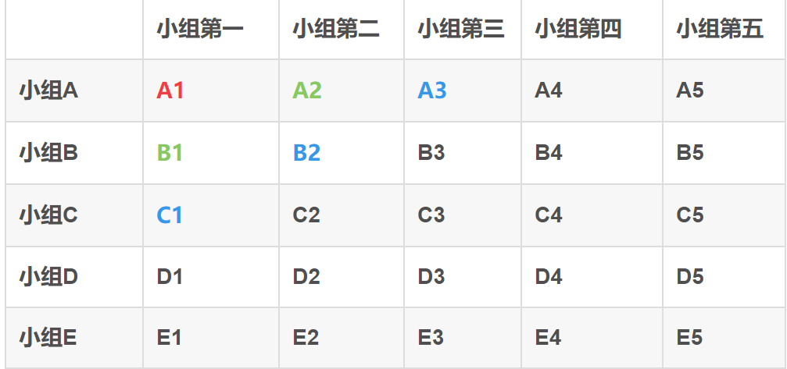

# FT专题

## 25匹马，5条跑道，最少次数找出最快的5匹马

显然，7次

首先分成5组，各跑一次，用掉5次

各组第一，来一次，用掉1次，此时已经决出最快的马

还剩第二第三



最快的就是左上角的那几个

## 电梯测试用例设计

1、功能测试：

（1）按钮功能，开门（运行中按开门键不开门），关门，电梯内按钮功能（电梯按键在按下时是否点亮，按错楼层是否可以取消）；

（2）上升，下降（每一层申请是否有效，是否可以正常停靠），超载时是否会忽略其它楼层的上行和下行申请，电梯的两边按钮是否都可以使用；

（3\) 电梯内电话、灯光等

2、性能测试：反应时间、关门时间、速度\(是否造成人体不适）

3、压力测试：超载，碰撞电梯壁

4、安全测试：

（1）进入电梯喊话，外面是否听到，拨打手机是否有信号；

（2）停电（不会坠落。电梯门可以通过外力打开，紧急电话可用），报警装置（超载），通风状况；

（3\) 停靠位置，有人扒门（不会强制关门），若有异物阻碍，会停在当前楼层；

\(4\) 监控装置

5、UI测试：标识的承重和人数，仅提供可到达楼层的按钮，美观程度，光滑程度、形状

6、可用性：按键高度、操作是否方便

7、稳定性：长时间运行情况

## 输出1-100里面的所有质数

什么是质数？只能被自己和1整除的数。

显然，两层循环，第一层遍历1到100（不包含1）

第二层从2开始，到这个数截至，不断取模，出现了0则break

```python
result = []
for i in range(2, 101):
    flag = True
    for j in range(2, i):
        if i % j == 0:
            flag = False
            break
    if flag == True:
        result.append(i)
print(result)
```

## 实现斐波那契数列


