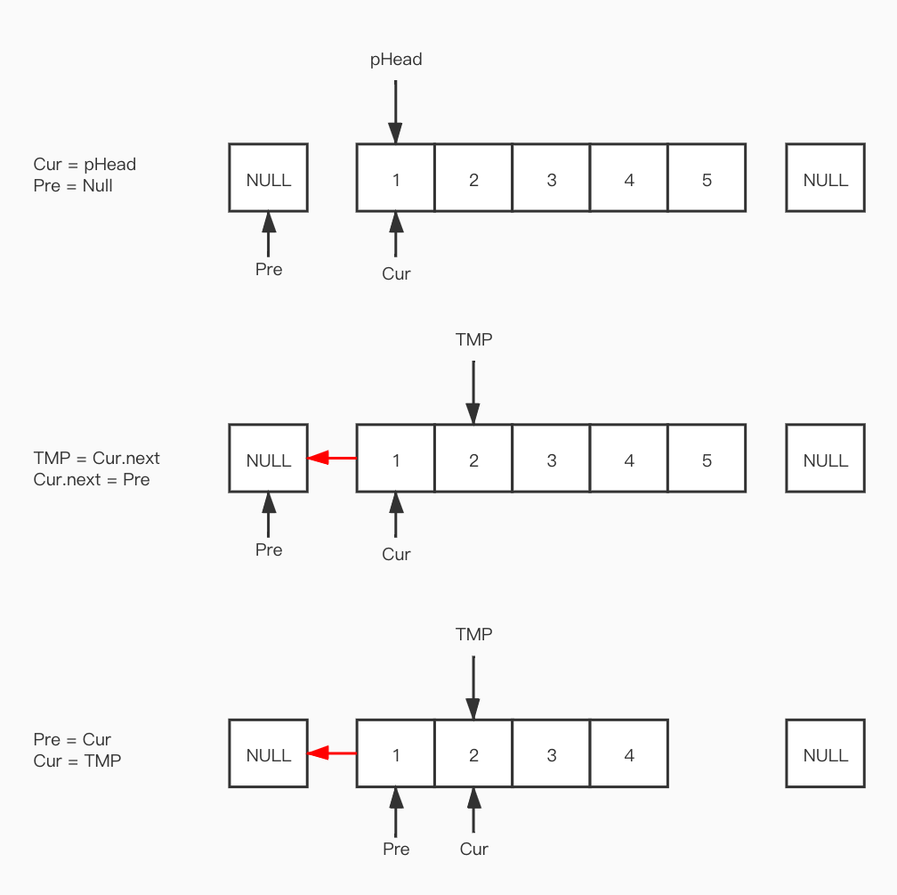

# Algorithm

## 1.在一个二维数组中（每个一维数组的长度相同），每一行都按照从左到右递增的顺序排序，每一列都按照从上到下递增的顺序排序。请完成一个函数，输入这样的一个二维数组和一个整数，判断数组中是否含有该整数。

思路1：暴力破解，遍历整个数组得到结果

```python
def solution(target, array):
    #1.异常排除：数组为空
    if array == None:
        return False
    #2.得到每一行的长度
    hangLength = len(array[0])
    #3.得到每一列的长度
    lieCount = len(array)
    #4.通过两个for循环遍历整个二维数组
    for i in range(lieCount):
        for j in range(hangLength):
            if array[i][j] == target:
                return True        
    #5.遍历了整个数组仍然没有的话就要返回False了
    return False    
```

思路2：由于数组顺序递增，选取右上角或者左下角作为pivot（如果逆序的话，就换一个对角线）。这里选取左下角作为pivot。比pivot大，说明比pivot所在的一整列都大。比pivot小，说明比pivot所在的一整行都小

```python
# -*- coding:utf-8 -*-
class Solution:
    # array 二维列表
    def Find(self, target, array):
        #1.异常处理
        if array == None:
            return False
        
        #2.选取左下角为pivot
        #左下角的坐标为 array[len(array)-1][0]
        hang = len(array)-1
        lie = 0
        #考虑[[]]的情况
        if hang <= 0:
            return False
        #3.开始比较,外围是一个循环
        while True:
            #如果pivot为target
            if array[hang][lie] == target:
                return True
            #如果pivot比target大，去掉当前这一行
            elif array[hang][lie] > target:
                hang -= 1
                #如果减掉1后已经越界,直接false
                if hang < 0 :
                    return False
            #如果pivot比target小，去掉当前这一列
            elif array[hang][lie] < target:
                lie += 1
                #如果加1越界，直接false
                if lie > len(array[0])-1:
                    return False
```

## 2.请实现一个函数，将一个字符串中的每个空格替换成“%20”。例如，当字符串为We Are Happy.则经过替换之后的字符串为We%20Are%20Happy。

思路1 遍历替换

```python
class Solution:
    def replaceSpace(self, s):
        # write code here
        s = list(s)
        count=len(s)
        for i in range(0,count):
            if s[i]==' ':
                s[i]='%20'
        return ''.join(s)
        
        ''' 运行时间：26ms 占用内存：5860k'''
```

思路2 空间换时间

```python
class Solution:
    # s 源字符串
    def replaceSpace(self, s):
        # write code here
        newList = []
        oldList = list(s)
        for i in range(len(s)):
            if oldList[i] == ' ':
                newList.append('%20')
            else:
                newList.append(oldList[i])
                
        return ''.join(newList)
        
        '''运行时间：26ms 占用内存：5860k'''
```

## 3.输入一个链表，按链表从尾到头的顺序返回一个ArrayList

思路: reverse\(\), insert\(\), return \[::-1\]

 没啥好说的，也可以用reverse\(\)

```python
class Solution:
    # 返回从尾部到头部的列表值序列，例如[1,2,3]
    def printListFromTailToHead(self, listNode):
        s=[]
        while listNode:
            s.append(listNode.val)
            listNode = listNode.next
        return s[::-1]
        
class Solution:
    # 返回从尾部到头部的列表值序列，例如[1,2,3]
    def printListFromTailToHead(self, listNode):
        
```

```python
class Solution:
    # 返回从尾部到头部的列表值序列，例如[1,2,3]
    def printListFromTailToHead(self, listNode):
        head = listNode
        #利用insert()函数
        resultList = []
        #利用一个循环读取链表
        while head:
            resultList.insert(0, head.val)
            head = head.next        
        return resultList
```

## 4.输入某二叉树的前序遍历和中序遍历的结果，请重建出该二叉树。假设输入的前序遍历和中序遍历的结果中都不含重复的数字。例如输入前序遍历序列{1,2,4,7,3,5,6,8}和中序遍历序列{4,7,2,1,5,3,8,6}，则重建二叉树并返回

首先需要明白的一点是，我们是从根结点出发，不停的找左右子树，来重新构建这个树的。那么解法如下 

1.找到整棵树的根节点。如何找？前序遍历的第一个元素就是根节点

2.找到这个根节点的左右节点。如何找？在中序遍历找到前面找到的根结点的位置，一分为二，出来两个序列

pre \[1,2,4,7,3,5,6,8\]  tin \[4,7,2,1,5,3,8,6\]

前序的第一个元素就是根节点，那么在tin中找到它的位置

\[4,7,2\] \[1\] \[5,3,8,6\]

根结点位于第3（从0开始）

那么在前序中我们就可以根据这个位置得到左子树的长度,右子树的长度

\[1\] 

\[2,4,7\]   ----&gt; pre\[1:i+1\]

 \[3,5,6,8\] ------&gt; pre\[i+1:\]

这两个子树的中序遍历就出来了

\[4,7,2\] -------&gt; tin\[:i\]

\[1\]

\[5,3,6,8\]--------&gt;tin\[i+1:\]

对这两个子树递归处理

每一次递归调用返回的都是的是根结点

```python
class Solution:
    # 返回构造的TreeNode根节点
    def reConstructBinaryTree(self, pre, tin):
        #0.错误处理
        if not pre or not tin:
            return None
        
        #1.构造一棵树，传入根节点 并用root指向这个根节点
        root = TreeNode(pre[0])
        
        #2.找到中序遍历中的根节点index
        i = tin.index(pre[0])
        
        #3.对切割后的左右子树继续切割
        #左子树的中序遍历和前序遍历
        root.left = self.reConstructBinaryTree(pre[1:i+1], tin[0:i])
        #右子树的中序遍历和前序遍历
        root.right = self.reConstructBinaryTree(pre[i+1:], tin[i+1:])
        
        return root
```

## 5.用两个栈来实现一个队列，完成队列的Push和Pop操作

思路

定义两个栈 stackIn , stackOut

入栈操作很简单, append就行

出栈操作分两种:

1.如果stackOut是空的，就把stackIn 里面的元素全部压入stackOut里面，让stackOut执行pop操作

2.如果stackOut不是空的，说明上一次出栈时，stackOut还有数据没有pop完，直接让stackOut pop即可

```python
# -*- coding:utf-8 -*-
class Solution:
    #1.定义两个list
    def __init__(self):
        self.stackIn = []
        self.stackOut = []
    
    def push(self, node):
        #2.入栈操作很简单，直接append
        self.stackIn.append(node)
        
    def pop(self):
        #3.出栈操作分两步
        #3.1 判断stackOut是否为空,如果为空，把In里面的数据都移动到Out里面来
        if self.stackOut == []:
            while self.stackIn != []:
                self.stackOut.append(self.stackIn.pop())
            return self.stackOut.pop()
        #3.2不为空,直接pop
        else:
            return self.stackOut.pop()
```

## 6.把一个数组最开始的若干个元素搬到数组的末尾，我们称之为数组的旋转。 输入一个非递减排序的数组的一个旋转，输出旋转数组的最小元素。 例如数组{3,4,5,1,2}为{1,2,3,4,5}的一个旋转，该数组的最小值为1。 NOTE：给出的所有元素都大于0，若数组大小为0，请返回0。

思路:既然看到了有序，考虑用二分法，但是这也不是单纯的有序，是进行了部分逆序的数组，所以要考虑一些特殊的情况

```python
# -*- coding:utf-8 -*-
class Solution:
    def minNumberInRotateArray(self, rotateArray):
        # write code here
        #0.异常处理
        if not rotateArray:
            return 0
        #二分法
        #1.找high low mid位
        high = len(rotateArray)-1
        low = 0
        
        while (low <= high):
            mid = int((high + low)/2)
            #2.让mid与high去比较
            #如果mid比high大,说明最小值在右边
            #low=mid+1
            if rotateArray[mid] > rotateArray[high]:
                low = mid + 1
            #如果mid比high小,说明最小值在左边,或者就是自己本身
            elif rotateArray[mid] < rotateArray[high]:
                #是自己本身的情况,那就是mid比high小，也比左边的数小
                if rotateArray[mid] < rotateArray[mid-1]:
                    return rotateArray[mid]
                #不是，更改high的位置
                else:
                    high = mid-1
            else:
                return rotateArray[mid]
```

## 7.大家都知道斐波那契数列，现在要求输入一个整数n，请你输出斐波那契数列的第n项（从0开始，第0项为0，第1项是1）。n&lt;=39

首先明确，什么是斐波那契数列

用文字来说，就是斐波那契数列由0和1开始，之后的斐波那契数就是由之前的两数相加而得出。首几个斐波那契数是：[0](https://zh.wikipedia.org/wiki/0), [1](https://zh.wikipedia.org/wiki/1), [1](https://zh.wikipedia.org/wiki/1), [2](https://zh.wikipedia.org/wiki/2), [3](https://zh.wikipedia.org/wiki/3), [5](https://zh.wikipedia.org/wiki/5), [8](https://zh.wikipedia.org/wiki/8), [13](https://zh.wikipedia.org/wiki/13), [21](https://zh.wikipedia.org/wiki/21), [34](https://zh.wikipedia.org/wiki/34), [55](https://zh.wikipedia.org/wiki/55), [89](https://zh.wikipedia.org/wiki/89), [144](https://zh.wikipedia.org/wiki/144), [233](https://zh.wikipedia.org/wiki/233)

思路1:递归,比较耗时

```python
# -*- coding:utf-8 -*-
class Solution:
    def Fibonacci(self, n):
        #0.异常处理
        if n == 0 or n == 1:
            return n
        
        #1.递归处理
        return self.Fibonacci(n-1) + self.Fibonacci(n-2)
```

思路：循环

```python
class Solution:
    def Fibonacci(self, n):
        # write code here
        #0.异常处理
        if n == 0 or n == 1:
            return n
        
        #1.计算结果是第一个数加上第二个数,循环叠加
        first = 0
        second = 1
        result = 0
        for i in range(2, n+1):
            result = first + second
            first = second
            second = result
        return result
```

## 8.一只青蛙一次可以跳上1级台阶，也可以跳上2级。求该青蛙跳上一个n级的台阶总共有多少种跳法

思路:斐波那契数列变种

```python
# -*- coding:utf-8 -*-
class Solution:
    def jumpFloor(self, n):
        # write code here
        #0.异常处理
        if n == 1 or n == 2:
            return n
        
        #1.计算结果是第一个数加上第二个数,循环叠加
        first = 1
        second = 2
        result = 3
        for i in range(3, n+1):
            result = first + second
            first = second
            second = result
        return result
```

## 9.一只青蛙一次可以跳上1级台阶，也可以跳上2级……它也可以跳上n级。求该青蛙跳上一个n级的台阶总共有多少种跳法。

还是斐波那契的变种

分析:  
       当n = 1 时， 只有一种跳法，即1阶跳：Fib\(1\) = 1;

       当n = 2 时， 有两种跳的方式，一阶跳和二阶跳：Fib\(2\) = Fib\(1\) + Fib\(0\) = 2;

       当n = 3 时，有三种跳的方式，第一次跳出一阶后，后面还有Fib\(3-1\)中跳法； 第一次跳出二阶后，后面还有Fib\(3-2\)中跳法；第一次跳出三阶后，后面还有Fib\(3-3\)中跳法

        Fib\(3\) = Fib\(2\) + Fib\(1\)+Fib\(0\)=4;

       当n = n 时，共有n种跳的方式，第一次跳出一阶后，后面还有Fib\(n-1\)中跳法； 第一次跳出二阶后，后面还有Fib\(n-2\)中跳法..........................第一次跳出n阶后，后面还有 Fib\(n-n\)中跳法.

       Fib\(n\) = Fib\(n-1\)+Fib\(n-2\)+Fib\(n-3\)+..........+Fib\(n-n\)=Fib\(0\)+Fib\(1\)+Fib\(2\)+.......+Fib\(n-1\)

      又因为Fib\(n-1\)=Fib\(0\)+Fib\(1\)+Fib\(2\)+.......+Fib\(n-2\)

      两式相减得：Fib\(n\)-Fib\(n-1\)=Fib\(n-1\)         =====》  Fib\(n\) = 2\*Fib\(n-1\)     n &gt;= 2

```python
# -*- coding:utf-8 -*-
class Solution:
    def jumpFloorII(self, number):
        if number==1 or number==0:
            return number
        return 2*self.jumpFloorII(number-1)
```


## 10.我们可以用2_1的小矩形横着或者竖着去覆盖更大的矩形。请问用n个2_1的小矩形无重叠地覆盖一个2\*n的大矩形，总共有多少种方法？

思路：还是斐波那契....

```python
# -*- coding:utf-8 -*-
class Solution:
    def rectCover(self, number):
        #0.异常处理
        if number == 0 or number == 1 or number == 2:
            return number
        #1.相加
        first = 1
        second = 2
        result = 0
        
        for i in range(3, number+1):
            result = first + second
            first = second
            second = result
            
        return result
```

## 11.输入一个整数，输出该数二进制表示中1的个数。其中负数用补码表示。

思路：如果一个整数不为0，那么这个整数至少有一位是1。如果我们把这个整数减1，那么原来处在整数最右边的1就会变为0，原来在1后面的所有的0都会变成1\(如果最右边的1后面还有0的话\)。其余所有位将不会受到影响。 把原来的整数和减去1之后的结果做与运算，从原来整数最右边一个1那一位开始所有位都会变成0。

举例来说，6的二进制是 110 ，6-1=5的二进制是 101，6&5=100， 如此操作之后6中原来的110变为100，循环计数统计1的个数，直至n变为0为止。

```python
# -*- coding:utf-8 -*-
class Solution:
    def NumberOf1(self, n):
        count = 0
        while n&0xffffffff != 0:
            count += 1
            n = n & (n-1)
        return count
```

## 12.给定一个double类型的浮点数base和int类型的整数exponent。求base的exponent次方。保证base和exponent不同时为0

思路: C++里面可能要考虑精度的问题，但是Python里面没有这样的问题，直接求乘积

```python
# -*- coding:utf-8 -*-
class Solution:
    def Power(self, base, exponent):
        #0.异常处理
        #base 为0，数学上不具有意义
        #exp 为0，=1
        if base == 0:
            return False
        if exponent == 0:
            return 1
        
        result = 1
        #注意，这里调用了abs()函数来取绝对值
        for i in range(1,abs(exponent)+1):
            result = result * base
        #1.如果exp是正值
        if exponent > 0:
            return result
        elif exponent < 0:
            return (1/result)
```

## 13.输入一个整数数组，实现一个函数来调整该数组中数字的顺序，使得所有的奇数位于数组的前半部分，所有的偶数位于数组的后半部分，并保证奇数和奇数，偶数和偶数之间的相对位置不变。

思路：空间换时间

```python
# -*- coding:utf-8 -*-
class Solution:
    def reOrderArray(self, array):
        #0.异常处理
        if len(array) == 0:
            return array
        
        #1.空间换时间 定义两个奇偶数组分别存放最后拼接
        odd = []
        even = []
        result = []
        
        #2.遍历一次 取出数字
        for i in range(len(array)):
            if array[i] % 2 == 1:
                odd.append(array[i])
            else:
                even.append(array[i])
                
        result = odd + even
        return result
```

## 14.输入一个链表，输出该链表中倒数第k个结点。

思路：Python 设置两个指针，p1，p2，先让p2走k-1步，然后再一起走，直到p2为最后一个 时，p1即为倒数第k个节点

举个例子:

\[1,2,3,4,5,6,7,8,9,10\]

找出倒数第2个

先让p1 走 2-1步

然后p1 p2 一起走

p2走到最后

p1就走到了倒数第2个

```python
# -*- coding:utf-8 -*-
# class ListNode:
#     def __init__(self, x):
#         self.val = x
#         self.next = None

class Solution:
    def FindKthToTail(self, head, k):
        # write code here
        #异常处理
        if head == None or k <= 0:
            return None
        
        #1.定义两个指针p1 p2都指向链表的头部
        p1= head 
        p2= head
        
        #2.p1先走k-1步
        for i in range(1,k):
            if p1.next == None:
                return None
            else:
                p1 = p1.next
        
        #3.p1 p2一起走
        while p1.next != None:
            p1 = p1.next
            p2 = p2.next
            
        return p2
```

## 15.输入一个链表，反转链表后，输出新链表的表头。

思路：3个指针



```python
class Solution:
    # 返回ListNode
    def ReverseList(self, pHead):
        #0.异常处理
        #pHead = None 或者pHead只有一个
        if pHead ==  None or pHead.next == None:
            return pHead
        
        #1.定义3个指针
        pre = None
        Cur = pHead
        Tmp = None
        
        #2.循环里面不停逆序
        while Cur != None:
            Tmp = Cur.next
            Cur.next = pre
            pre = Cur
            Cur = Tmp
        return pre
```

## 16.输入两个单调递增的链表，输出两个链表合成后的链表，当然我们需要合成后的链表满足单调不减规则。

思路：没啥好说的，遍历，赋值

```python
# -*- coding:utf-8 -*-
# class ListNode:
#     def __init__(self, x):
#         self.val = x
#         self.next = None
class Solution:
    # 返回合并后列表
    def Merge(self, pHead1, pHead2):
        # write code here
        #0.异常处理
        if pHead1 == None:
            return pHead2
        elif pHead2 == None:
            return pHead1
        elif pHead2 == None and pHead1 == None:
            return None
        
        #1.定义一个新的链表，用来存放合成的数据
        pResult = ListNode(0)
        #再定义一个指针，用来移动赋值
        p = pResult
            
        #2.循环处理后面的
        while pHead1 != None and pHead2 != None:
            #如果p2大于等于了p1
            if pHead1.val <= pHead2.val:
                p.next = pHead1
                pHead1 = pHead1.next
            #如果p1大于了p2
            elif pHead1.val > pHead2.val:
                p.next = pHead2
                pHead2 = pHead2.next
            
            #每次赋值完成，p都要后移一位
            p = p.next
        #3.循环跳出了,说明有一个链表到头，后续的链表直接
        if pHead2 != None:
            p.next = pHead2
        else:
            p.next = pHead1
            
        #4.这个链表初始化的时候，给了一个0，但是实际是不需要的
        return pResult.next
```

## 17.输入两棵二叉树A，B，判断B是不是A的子结构。（ps：我们约定空树不是任意一个树的子结构）

**当Tree1和Tree2都不为零的时候，才进行比较。否则直接返回false**

**如果找到了对应Tree2的根节点的点，**

**以这个根节点为为起点判断是否包含Tree2**

**如果找不到，那么就再去root的左孩子当作起点，去判断时候包含Tree2**

**如果还找不到，那么就再去root的右孩子当作起点，去判断时候包含Tree2**

```python
# -*- coding:utf-8 -*-
# class TreeNode:
#     def __init__(self, x):
#         self.val = x
#         self.left = None
#         self.right = None
class Solution:
    def HasSubtree(self, pRoot1, pRoot2):
        #0.异常处理
        if pRoot1 == None or pRoot2 == None:
            return False
        
        #如果p2的根与p1的根相等了，则可能是子树了，开始判断
        #如果第一次的根没找着，继续找左边的根，或者右边的根
        return self.isSubTree(pRoot1, pRoot2) or self.HasSubtree(pRoot1.left,pRoot2) or self.HasSubtree(pRoot1.right, pRoot2)
            
        
    def isSubTree(self, pRoot1, pRoot2):
        #这是一个递归函数，如果递归到最后，pRoot2已经遍历完还没有返回False，说明是子树
        if pRoot2 == None:
            return True
        #！！！如果递归到最后是pRoot1先递归完，说明也不是子树
        if pRoot1 == None:
            return False
        #如果在某一次递归发现了节点不一致,返回false
        if pRoot1.val != pRoot2.val:
            return False
        #进行递归
        return self.isSubTree(pRoot1.left, pRoot2.left) and self.isSubTree(pRoot1.right, pRoot2.right)
        
```

**注意，在HasSubTree里面遇到了一个坑，一开始是这样写的，一直无法通过**

```python
        #如果p2的根与p1的根相等了，则可能是子树了，开始判断
        if pRoot1.val == pRoot2.val
            return self.isSubTree(pRoot1, pRoot2)
        #如果第一次的根没找着，继续找左边的根，或者右边的根
        return  or self.HasSubtree(pRoot1.left,pRoot2) or self.HasSubtree(pRoot1.right, pRoot2)

```

这样写是有问题的，因为即使第一个根一致，一旦后面不一致，就会直接返回False了，而不会接着往下判断其他的根节点，因此如果想要这样写，要用个flag记录第一个根的结果，看看需不需要接着往下判断

## 18.操作给定的二叉树，将其变换为源二叉树的镜像

思路:递归交换就wan sir 了嗷凑弟弟

```python
# -*- coding:utf-8 -*-
# class TreeNode:
#     def __init__(self, x):
#         self.val = x
#         self.left = None
#         self.right = None
class Solution:
    # 返回镜像树的根节点
    def Mirror(self, root):
        #0.异常处理
        if root == None:
            return None
        
        #1.如果已经走到了叶子节点
        if root.left == None and root.right == None:
            return root
        #2.不是叶子节点，继续递归交换
        else:
            root.left , root.right = root.right, root.left
            self.Mirror(root.left)
            self.Mirror(root.right)
```

## 19.输入一个矩阵，按照从外向里以顺时针的顺序依次打印出每一个数字，例如，如果输入如下4 X 4矩阵： 1 2 3 4 5 6 7 8 9 10 11 12 13 14 15 16 则依次打印出数字1,2,3,4,8,12,16,15,14,13,9,5,6,7,11,10.

思路：我快吐了，做好异常与特殊值的处理：只有一行？只有一列？只有一个？

以及非矩阵可能重复读取的问题line 52

```python
# -*- coding:utf-8 -*-
class Solution:
    # matrix类型为二维列表，需要返回列表
    def printMatrix(self, matrix):
        #0.异常处理
        if not matrix:
            return False

        if len(matrix[0]) == 1 and len(matrix) != 1:
            result = []
            for i in range(len(matrix)):
                result.append(matrix[i][0])
            return result
        
        if len(matrix) == 1:
            result = []
            for i in range(len(matrix[0])):
                result.append(matrix[0][i])
            return result


        
        #1.定义左上角，右下角两个位置
        '''
        1 2 3 .. 
        4 5 6 ..
        . .
        . .      [y][x]
        '''
        #右下角坐标
        x = len(matrix[0])-1
        y = len(matrix)-1

        #初始坐标
        x0 = 0
        y0 = 0
        
        result = []
        
        #2.循环遍历
        #循环跳出条件,坐标溢出了
        while y0 <= y and x0 <= x:
            #上
            for i in range(x0,x+1):
                result.append(matrix[y0][i])

            #右
            #从y0+1行开始从上往下
            for i in range(y0+1,y+1):
                result.append(matrix[i][x])

            if y0 != y:
                #下
                #从y行开始从右边倒数第二个 从右往左
                for i in range(x-x0):
                    result.append(matrix[y][x-1-i])

                #左    
                #从y-1行开始，从下往上,
                for i in range(y-1-y0):
                    result.append(matrix[y-1-i][x0])

            #坐标缩圈
            x0 += 1
            y0 += 1
            x -= 1
            y -= 1
        print(result)
        return result
```

## 20.定义栈的数据结构，请在该类型中实现一个能够得到栈中所含最小元素的min函数（时间复杂度应为O（1））。 注意：保证测试中不会当栈为空的时候，对栈调用pop\(\)或者min\(\)或者top\(\)方法。

思路：多定义一个stackMin，用来存放最小值，当然，在压入和弹出的时候，都要判断是不是最小值

```python
class Solution:
    def __init__(self):
        self.stack = []
        self.min_stack = []
    def push(self, node):
        self.stack.append(node)
        #压入新node的时候同时要判断应不应该压入stackMin
        if not self.min_stack or node <= self.min_stack[-1]:
            self.min_stack.append(node)
    def pop(self):
        #同理，弹出node的时候也要判断是不是最小值
        if self.stack[-1] == self.min_stack[-1]:
            self.min_stack.pop()
        self.stack.pop()
    def top(self):
        return self.stack[-1]
    def min(self):
        return self.min_stack[-1]
```

## 21.从上往下打印出二叉树的每个节点，同层节点从左至右打印。

思路：用两个list，一个用来装节点，一个用来装节点的value。对于装节点的这个list，我们每次弹出最前面的节点，并依次将左节点和右节点加在后面。不管怎么样，这个装节点的list都能保证，将节点从上到下，同层节点从左到右进行添加、弹出。

```python
# -*- coding:utf-8 -*-
# class TreeNode:
#     def __init__(self, x):
#         self.val = x
#         self.left = None
#         self.right = None
class Solution:
    # 返回从上到下每个节点值列表，例：[1,2,3]
    def PrintFromTopToBottom(self, root):
        # write code here
        #0.异常处理
        if not root:
            return []
        
        #1.定义两个队列,一个存放结果,一个存放每层节点
        result = []
        node = []
        node.append(root)
        
        #2.循环处理
        while node != []:
            tmpNode = node.pop(0)
            result.append(tmpNode.val)
            
            #看这个节点有没有左右节点
            if tmpNode.left:
                node.append(tmpNode.left)
                
            if tmpNode.right:
                 node.append(tmpNode.right)
        
        return result
```

## 22.输入一个非空整数数组，判断该数组是不是某二叉搜索树的后序遍历的结果。如果是则输出Yes,否则输出No。假设输入的数组的任意两个数字都互不相同。

思路:

首先，什么是二叉搜索树？左边的都比根节点小，右边的都比根节点大

其次，后序遍历有什么特点？左-》右-》根

```python
# -*- coding:utf-8 -*-
class Solution:
    def VerifySquenceOfBST(self, sequence):
        #0.异常处理
        if len(sequence) == 1:
            return True
        
        if not sequence:
            return False
        
        #1.找到最后一个元素，它是根节点
        root = sequence[-1]
        Index = 0
        #2.从头开始，找可能的左右子树的分界index
        for i in range(len(sequence)):
            if sequence[i] >= root:
                Index = i
                break
        
        leftSeq = sequence[0:Index]
        rightSeq = sequence[Index:-1]
        
        #3.理论上来说，右子树里面的值，都比根结点大
        for i in range(len(rightSeq)):
            if rightSeq[i] < root:
                return False
            
        #4.递归处理
        #return self.VerifySquenceOfBST(leftSeq) and self.VerifySquenceOfBST(rightSeq)
        leftFlag = True
        rightFlag = True
        #4.不能直接递归，先要判断左右子树为不为空
        if len(leftSeq) > 0:
            leftFlag = self.VerifySquenceOfBST(leftSeq)

        if len(rightSeq) > 0:
            rightFlag = self.VerifySquenceOfBST(rightSeq)

        return leftFlag and rightFlag
    
```

## 23.输入一颗二叉树的根节点和一个整数，打印出二叉树中结点值的和为输入整数的所有路径。路径定义为从树的根结点开始往下一直到叶结点所经过的结点形成一条路径。

思路:注意题目中关于路径的定义，必须是从根结点到叶结点，也就是说这其实是树的深度优先遍历DFS（前面那道题是广度优先遍历），那么答案基本已经出来了，在深度优先的同时，进行结点值的相加，判断当前路径是否符合期待

注意，可能在递归调用里面传的是path + \[xxx.val\],这可以保证如果最后的结果不是我们要的，可以回退到根结点的位置，而不需要删除已经压入的结点

```python
class Solution:
    # 返回二维列表，内部每个列表表示找到的路径
    def FindPath(self, root, expectNumber):
        # write code here
        #定义用来存放最终结果的二维列表
        result = []
        #0.异常处理
        if not root:
            return result
        
        #定义用来存放单个结果的数组
        path = [root.val]
        
        #1.开始进行深度优先的遍历
        self.DFS(root, expectNumber, path, result)
        return result
        
    def DFS(self, root, expectNumber, path, result):
        #如果左子树，右子树都不存在，且路径之和等于expectNumber
        #那就把当前路径加入总结果
        if not root.left and not root.right and sum(path) == expectNumber:
            result.append(path)
        #如果存在左子树,继续递归，因为是深度优先
        if root.left:
            self.DFS(root.left, expectNumber, path+[root.left.val], result)
        if root.right:
            self.DFS(root.right, expectNumber, path+[root.right.val], result)
```

## 24.输入一个复杂链表（每个节点中有节点值，以及两个指针，一个指向下一个节点，另一个特殊指针random指向一个随机节点），请对此链表进行深拷贝，并返回拷贝后的头结点。（注意，输出结果中请不要返回参数中的节点引用，否则判题程序会直接返回空）


## 25.输入一个字符串,按字典序打印出该字符串中字符的所有排列。例如输入字符串abc,则打印出由字符a,b,c所能排列出来的所有字符串abc,acb,bac,bca,cab和cba。

思路：这一题没什么思路，主要是理解网上别人写的方法

用到了Python中集合这种数据结构的一些特性，比方说集合是必定不重复的

```python
class Solution:
    def Permutation(self, ss):
        if not ss:
            return []
        res = []
        self.helper(ss, res, '')
        return sorted(list(set(res)))

    def helper(self, ss, res, path):
        if not ss:
            res.append(path)
        else:
            for i in range(len(ss)):
                self.helper(ss[:i] + ss[i+1:], res, path + ss[i])
```

## 26.数组中有一个数字出现的次数超过数组长度的一半，请找出这个数字。例如输入一个长度为9的数组{1,2,3,2,2,2,5,4,2}。由于数字2在数组中出现了5次，超过数组长度的一半，因此输出2。如果不存在则输出0

思路1：空间换时间，最容易想到的，注意字典的使用语法

```python
class Solution:
    def MoreThanHalfNum_Solution(self, numbers):
        # write code here
        #0.异常处理
        if not numbers:
            return 0
        
        
        #1.空间换时间
        dic = {}
        
        for i in range(len(numbers)):
            if dic.has_key(numbers[i]):
                dic[numbers[i]] += 1
            else:
                dic[numbers[i]] = 1
                
            if dic[numbers[i]] > (len(numbers)/2):
                return numbers[i]
        return 0
```

思路2：较为巧妙，权值抵消法，仅供参考

```python
class Solution:
    def MoreThanHalfNum_Solution(self, numbers):
        # write code here
        #0.异常处理
        if not numbers:
            return 0
        if len(numbers) == 1:
            return numbers[0]
        
        #1.设定一个基准值
        pivot = numbers[0]
        pivotVal = 1
        
        for i in range(1,len(numbers)):
            if numbers[i] == pivot:
                pivotVal += 1
                if pivotVal > (len(numbers)/2):
                    return pivot
            else:
                pivotVal -= 1
                if pivotVal == 0:
                    pivot = numbers[i]
                    pivotVal = 1
        if pivotVal > 1:
            return pivot
        else:
            return 0
```


## 27.数组中有一个数字出现的次数超过数组长度的一半，请找出这个数字。例如输入一个长度为9的数组{1,2,3,2,2,2,5,4,2}。由于数字2在数组中出现了5次，超过数组长度的一半，因此输出2。如果不存在则输出0。

思路:空间换时间

```python
# -*- coding:utf-8 -*-
class Solution:
    def MoreThanHalfNum_Solution(self, numbers):
        #空间换时间
        #0.异常处理
        if not numbers:
            return 0
        if len(numbers) == 1:
            return numbers[0]
        
        dic = {}
        numLen = len(numbers)//2
        
        #1.遍历数组
        for i in range(len(numbers)):
            if dic.has_key(numbers[i]):
                dic[numbers[i]] += 1
                if dic[numbers[i]] > numLen:
                    return numbers[i]
            else:
                dic[numbers[i]] = 1
        
        return 0
```

## ?.在一个长度为n的数组里的所有数字都在0到n-1的范围内。 数组中某些数字是重复的，但不知道有几个数字是重复的。也不知道每个数字重复几次。请找出数组中任意一个重复的数字。 例如，如果输入长度为7的数组{2,3,1,0,2,5,3}，那么对应的输出是第一个重复的数字2。

思路：空间换时间

```python
# -*- coding:utf-8 -*-
class Solution:
    # 这里要特别注意~找到任意重复的一个值并赋值到duplication[0]
    # 函数返回True/False
    def duplicate(self, numbers, duplication):
        # write code here
        #0.异常处理
        if not numbers:
            return False
        
        #1.空间换时间
        dic = {}
        
        for i in range(len(numbers)):
            if dic.has_key(numbers[i]):
                dic[numbers[i]] += 1
                if dic[numbers[i]] == 2:
                    duplication[0] = numbers[i]
                    return True
                    
            else:
                dic[numbers[i]] = 1
                
        return False
        
```

思路：不需要额外的数组或者hash table来保存，题目里写了数组里数字的范围保证在0 ~ n-1 之间，所以可以利用现有数组设置标志，当一个数字被访问过后，可以设置对应位上的数 + n，之后再遇到相同的数时，会发现对应位上的数已经大于等于n了，那么直接返回这个数即可。

## ?.输入一棵二叉树，求该树的深度。从根结点到叶结点依次经过的结点（含根、叶结点）形成树的一条路径，最长路径的长度为树的深度。

思路1：与之前的深度遍历类似，修改了最终变量的判断，不是路径的和，而是路径的长度，此长度即为深度

```python
class Solution:
    def TreeDepth(self, pRoot):
        # write code here
        #之前有一道，利用深度优先遍历，求路径的题，与这道类似，思想类似
        #定义结果
        result = [0]
        #0.异常处理
        if not pRoot:
            return 0
        
        #路径
        path = [pRoot.val]
        
        #1.递归调用
        self.DFS(pRoot, result, path)
        
        return result[0]
        
    def DFS(self, pRoot, result, path):
        #2.如果左子树右子树都没有了，说明到了叶子,判断这个path这个数组的长度，即为深度
        if not pRoot.left and not pRoot.left:
            if len(path) > result[0]:
                result[0] = len(path)
        #3.如果左子树还有
        if pRoot.left:
            #继续深入
            self.DFS(pRoot.left, result, path+[pRoot.left.val])
        #4.如果右子树还有
        if pRoot.right:
            self.DFS(pRoot.right, result, path+[pRoot.right.val])
```

思路2：看看别人写的

```python
class Solution:
    def TreeDepth(self, pRoot):
 
        if pRoot==None:
               return 0
        return max(self.TreeDepth(pRoot.left),self.TreeDepth(pRoot.right))+1
```

## ?.输入一棵二叉树，判断该二叉树是否是平衡二叉树。在这里，我们只需要考虑其平衡性，不需要考虑其是不是排序二叉树

思路：我再次使用了DFS的方法来遍历左右两颗子树的深度，求两颗左右子树的差值，来判断是否平衡

```python
class Solution:
    def IsBalanced_Solution(self, pRoot):
        # write code here
        #0.异常处理
        if not pRoot:
            return True
        if pRoot == {}:
            return True
        
        #1.对左子树与右子树分别求最大深度,计算差值
        LeftResult = [0]
        RightResult = [0]
        
        if pRoot.left:
            path1 = [pRoot.left]
            self.MaxDeep(pRoot.left, path1, LeftResult)

        if pRoot.right:
            path2 = [pRoot.right]
            self.MaxDeep(pRoot.right, path2, RightResult)

        if abs(LeftResult[0] - RightResult[0]) > 1:
            return False
        else:
            return True
        
    def MaxDeep(self, root, path, result):
        if not root.left and not root.right:
            if result[0] < len(path):
                result[0] = len(path)
        if root.left:
            self.MaxDeep(root.left, path+[root.left], result)
        if root.right:
            self.MaxDeep(root.right, path+[root.right], result)
```

